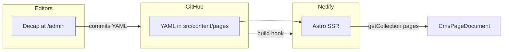

# pbl-com

Astro site that serves **CMS-managed HTML pages**: editors use **Decap CMS** at `/admin`, content lives as YAML in the repo under `src/content/pages/`, and **Netlify** runs **Astro SSR** (via `@astrojs/netlify`) so each request resolves the right page from the content collection.

---

## Deploy to Netlify

First-time launch, environment setup, smoke tests, rollback, and the
post-launch checklist live in [`deploy.md`](deploy.md). Follow it
top-to-bottom for a production launch.

---

## What this application does

### Architecture

- **Framework**: [Astro 6](https://astro.build/) with **server output** (`output: 'server'`) in [`astro.config.mjs`](astro.config.mjs).
- **Hosting**: [`@astrojs/netlify`](https://docs.astro.build/en/guides/integrations-guide/netlify/) adapter in **middleware (edge)** mode so routes run on Netlify with `getCollection` at request time.
- **CMS**: [Decap CMS](https://decapcms.org/) 3.1.2 loaded from `unpkg` on [`src/pages/admin.astro`](src/pages/admin.astro), config URL [`/admin/config.yml`](public/admin/config.yml).  
  **Preview + URL field**: [`public/admin/decap-pages-preview.js`](public/admin/decap-pages-preview.js) registers an iframe preview (`CMS_MANUAL_INIT` so scripts run before init) and a compact **URL Path** line: small preview link (new tab) + icon to copy the full URL (domain = wherever `/admin` is opened).
- **Content**: YAML files under `src/content/pages/`, schema in [`src/content.config.ts`](src/content.config.ts).
- **Rendering**: [`src/components/CmsPageDocument.astro`](src/components/CmsPageDocument.astro) outputs a full HTML document, injecting `htmlContent` and optional `headHtml` via `set:html`.

### Routing

- **`/`**: [`src/pages/index.astro`](src/pages/index.astro) loads the `pages` collection and selects the entry whose normalized path is the site root (empty path after stripping slashes).
- **All other paths**: [`src/pages/[...slug].astro`](src/pages/[...slug].astro) matches `slug` segments, normalizes them, and finds the matching `urlPath`.  
  Both routes use `export const prerender = false` so pages reflect the latest YAML after each deploy.
- **Legacy URLs**: [`netlify.toml`](netlify.toml) redirects `/keystatic` and `/keystatic/*` to `/admin` (301).
- **`/access`**: Email gate for protected pages (see below). Not part of the CMS `pages` collection.

### Content model (`pages` collection)

| Field           | Purpose |
| --------------- | ------- |
| `title`         | Page title (and Decap list label); used in `<title>`. |
| `urlPath`       | Site path, e.g. `/` for home or `clients/preview/foo/bar` (no leading/trailing slash inconsistency—normalize to how the app resolves paths). |
| `htmlContent`   | Full HTML for `<body>`; may include scripts. |
| `headHtml`      | Optional raw HTML merged into `<head>` (meta, link, script, style). |
| `isProtected`   | When `true`, edge middleware requires a valid access cookie or Netlify Identity JWT whose email is listed in `allowedEmails` for that `urlPath`. |
| `allowedEmails` | Addresses allowed to view that URL (required when `isProtected` is true). Matching is case-insensitive. |

### Protected pages

- On deploy, [`scripts/generate-protected-manifest.mjs`](scripts/generate-protected-manifest.mjs) writes [`src/generated/protected-pages.json`](src/generated/protected-pages.json). [`src/middleware.ts`](src/middleware.ts) uses it on Netlify Edge.
- Visitors without a session are redirected to `/access?next=…`. Submitting an allowed email sets a signed HttpOnly cookie (`pbl_access`). Wrong or missing access yields **404** (not 403).
- Optional Netlify Identity: set `IDENTITY_JWT_SECRET` and `PUBLIC_NETLIFY_IDENTITY_URL`; the `/access` page can load the Identity widget so users sign in with the same email as in `allowedEmails`.

### Environment variables

| Variable | Required | Purpose |
| -------- | -------- | ------- |
| `ACCESS_COOKIE_SECRET` | **Yes** (for protected pages) | HMAC key for signing the `pbl_access` JWT. |
| `IDENTITY_JWT_SECRET` | No | Site JWT secret from Netlify Identity (Settings → Identity → Services → JWT); enables `nf_jwt` in middleware. |
| `PUBLIC_NETLIFY_IDENTITY_URL` | No | e.g. `https://your-site.netlify.app/.netlify/identity` for the widget on `/access`. |

Copy [`.env.example`](.env.example) to `.env` for local dev. On Netlify, set `ACCESS_COOKIE_SECRET` (and optional Identity vars) in **Site configuration → Environment variables**. Decap GitHub OAuth remains configured only in the Netlify UI (no app env needed for the CMS backend itself).

---

## Local development

From the repository root:

| Command | Action |
| ------- | ------ |
| `npm install` | Install dependencies. |
| `npm run dev` | Dev server at [http://localhost:4321](http://localhost:4321). |
| `npm run build` | Production build (same as Netlify build step locally). |
| `npm run preview` | Preview the production build locally. |
| `npm run check` | Run `astro check` (types/content). |
| `npm run verify:root-home` | Assert a single root `urlPath` for home (project-specific guard). |
| `npm run migrate:old-dist` | Migration helper for prior `dist` layout (see `scripts/`). |

### Decap locally

For local `/admin` against a local Git proxy, see comments in [`public/admin/config.yml`](public/admin/config.yml). **Do not commit** with `local_backend: true` enabled for production—keep `local_backend: false` in the shared repo.

---

## Useful links

- [Astro docs](https://docs.astro.build/)
- [Deploy Astro to Netlify](https://docs.astro.build/en/guides/deploy/netlify/)
- [Decap CMS — GitHub backend](https://decapcms.org/docs/github-backend/)
