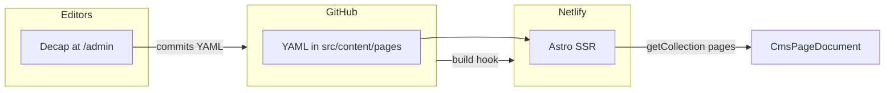

# pbl-com

Astro site that serves **CMS-managed HTML pages**: editors use **Decap CMS** at `/admin`, content lives as YAML in the repo under `src/content/pages/`, and **Netlify** runs **Astro SSR** (via `@astrojs/netlify`) so each request resolves the right page from the content collection.

---

## Go live on Netlify (quick path)

Follow these steps in order so the site and the CMS both work. Replace placeholders with your values (`YOUR_ORG`, `YOUR_REPO`, production branch name—often `main`).

### 1. GitHub repository

1. Create a repository (or use an existing one) and push this project’s code to it.
2. Note the full name: `YOUR_ORG/YOUR_REPO`.
3. Decide the **production branch** Netlify will deploy (commonly `main`).

### 2. Netlify: connect the site

1. In [Netlify](https://www.netlify.com/), choose **Add new site** → **Import an existing project**.
2. Connect **GitHub** and select `YOUR_ORG/YOUR_REPO`.
3. Set the **production branch** to match your Git default (e.g. `main`).

### 3. Build settings

This repo pins Node in [`netlify.toml`](netlify.toml) (`NODE_VERSION`) and declares the build command. In the Netlify UI you should see at least:

| Setting        | Value              |
| -------------- | ------------------ |
| Build command  | `npm run build`    |
| Base directory | *(repo root)*      |

**Do not** treat this like a classic static site only: Astro is configured with `output: 'server'` and the Netlify adapter. Let Netlify’s **Astro** integration handle the serverless/edge output; avoid forcing a “publish directory” that only uploads static files and drops SSR. If Netlify shows framework-specific hints, follow [Deploy your Astro site to Netlify](https://docs.astro.build/en/guides/deploy/netlify/).

### 4. First deploy

1. Trigger a deploy (automatic after connect, or **Deploy site** manually).
2. Open the deploy log: confirm **Build succeeded**.
3. Open the site URL: you should get a response (home page content depends on having a `pages` entry for `/`; see [Content model](#content-model)).

### 5. Align Decap with your repo

Decap reads [`public/admin/config.yml`](public/admin/config.yml). Before editors use `/admin`:

1. Set **`backend.repo`** to `YOUR_ORG/YOUR_REPO` (must match the GitHub repo Netlify built from).
2. Set **`backend.branch`** to the same branch editors should commit to (usually your production branch, e.g. `main`).
3. Commit and push. Netlify will rebuild; after deploy, `/admin` targets the correct repository.

### 6. GitHub OAuth App (for CMS login)

Decap’s GitHub backend relies on Netlify’s OAuth proxy. You need a **GitHub OAuth App**:

1. GitHub → **Settings** → **Developer settings** → **OAuth Apps** → **New OAuth App**.
2. **Application name**: any label you like.
3. **Homepage URL**: your Netlify site URL, e.g. `https://your-site.netlify.app`.
4. **Authorization callback URL** (exactly): `https://api.netlify.com/auth/done`  
   See [Decap: GitHub backend](https://decapcms.org/docs/github-backend/).

Create the app, then copy the **Client ID** and generate a **Client secret**.

### 7. Netlify: enable GitHub OAuth provider

1. Netlify → your site → **Site configuration** → **Access & security** → **OAuth**.
2. Under **Authentication providers**, enable **GitHub**.
3. Paste the GitHub OAuth App **Client ID** and **Client secret** (store the secret only in Netlify, never in the repo).

### 8. Smoke test CMS

1. Open `https://<your-site>/admin`.
2. Log in with GitHub when prompted (user must have appropriate access to `YOUR_ORG/YOUR_REPO`).
3. Confirm the **Pages** collection loads and a small test save works (commits go to the branch set in `config.yml`).  
   If you use **branch protection** on that branch, ensure editors can still push or use a workflow that allows Decap’s commits (e.g. pull requests, depending how you configure the backend).

---

## Checklists for handoff

Use these to confirm nothing critical was skipped.

### Pre-launch — repository and hosting

- [ ] GitHub repo exists and contains this codebase.
- [ ] Netlify site is linked to the correct repo and **production branch**.
- [ ] Latest deploy **passed** (build log green).
- [ ] [`public/admin/config.yml`](public/admin/config.yml) `backend.repo` and `backend.branch` match that repo and branch.
- [ ] **Node** version satisfies `package.json` `engines` (≥ 22.12.0); repo uses `NODE_VERSION` in [`netlify.toml`](netlify.toml).
- [ ] **Home page**: at least one `pages` YAML entry has `urlPath` that resolves to the site root (see [Routing](#routing)).
- [ ] **Media**: Decap uses `media_folder: public/uploads` and `public_folder: /uploads`; ensure editors know uploads go there (folder may be created on first upload).

### CMS and access

- [ ] **GitHub OAuth App** created with callback **exactly** `https://api.netlify.com/auth/done`.
- [ ] **Netlify** OAuth provider **GitHub** enabled with Client ID + secret from that app.
- [ ] Everyone who edits the CMS has **GitHub access** to the content repo (and permissions compatible with how Decap writes commits).
- [ ] Team knows who **reviews/merges** if the target branch is protected.

---

## What this application does

### Architecture

- **Framework**: [Astro 6](https://astro.build/) with **server output** (`output: 'server'`) in [`astro.config.mjs`](astro.config.mjs).
- **Hosting**: [`@astrojs/netlify`](https://docs.astro.build/en/guides/integrations-guide/netlify/) adapter in **middleware (edge)** mode so routes run on Netlify with `getCollection` at request time.
- **CMS**: [Decap CMS](https://decapcms.org/) 3.1.2 loaded from `unpkg` on [`src/pages/admin.astro`](src/pages/admin.astro), config URL [`/admin/config.yml`](public/admin/config.yml).  
  **Preview**: [`public/admin/decap-pages-preview.js`](public/admin/decap-pages-preview.js) registers an iframe preview (`CMS_MANUAL_INIT` so scripts run before init).
- **Content**: YAML files under `src/content/pages/`, schema in [`src/content.config.ts`](src/content.config.ts).
- **Rendering**: [`src/components/CmsPageDocument.astro`](src/components/CmsPageDocument.astro) outputs a full HTML document, injecting `htmlContent` and optional `headHtml` via `set:html`.

### Routing

- **`/`**: [`src/pages/index.astro`](src/pages/index.astro) loads the `pages` collection and selects the entry whose normalized path is the site root (empty path after stripping slashes).
- **All other paths**: [`src/pages/[...slug].astro`](src/pages/[...slug].astro) matches `slug` segments, normalizes them, and finds the matching `urlPath`.  
  Both routes use `export const prerender = false` so pages reflect the latest YAML after each deploy.
- **Legacy URLs**: [`netlify.toml`](netlify.toml) redirects `/keystatic` and `/keystatic/*` to `/admin` (301).

### Content model (`pages` collection)

| Field           | Purpose |
| --------------- | ------- |
| `title`         | Page title (and Decap list label); used in `<title>`. |
| `urlPath`       | Site path, e.g. `/` for home or `clients/preview/foo/bar` (no leading/trailing slash inconsistency—normalize to how the app resolves paths). |
| `htmlContent`   | Full HTML for `<body>`; may include scripts. |
| `headHtml`      | Optional raw HTML merged into `<head>` (meta, link, script, style). |
| `isProtected`   | Stored in content and CMS; **not enforced** by the server today—all published routes are publicly reachable. |
| `allowedEmails` | Stored for potential future access rules; **not enforced** today. |

### Environment variables

The app **does not** read `import.meta.env` / `process.env` in `src/` for core behavior. You do **not** need a `.env` file on Netlify for standard deploy + Decap. Keep **OAuth secrets** in the Netlify UI only.

---

## Local development

From the repository root:

| Command | Action |
| ------- | ------ |
| `npm install` | Install dependencies. |
| `npm run dev` | Dev server at [http://localhost:4321](http://localhost:4321). |
| `npm run build` | Production build (same as Netlify build step locally). |
| `npm run preview` | Preview the production build locally. |
| `npm run check` | Run `astro check` (types/content). |
| `npm run verify:root-home` | Assert a single root `urlPath` for home (project-specific guard). |
| `npm run migrate:old-dist` | Migration helper for prior `dist` layout (see `scripts/`). |

### Decap locally

For local `/admin` against a local Git proxy, see comments in [`public/admin/config.yml`](public/admin/config.yml). **Do not commit** with `local_backend: true` enabled for production—keep `local_backend: false` in the shared repo.

---

## Useful links

- [Astro docs](https://docs.astro.build/)
- [Deploy Astro to Netlify](https://docs.astro.build/en/guides/deploy/netlify/)
- [Decap CMS — GitHub backend](https://decapcms.org/docs/github-backend/)
