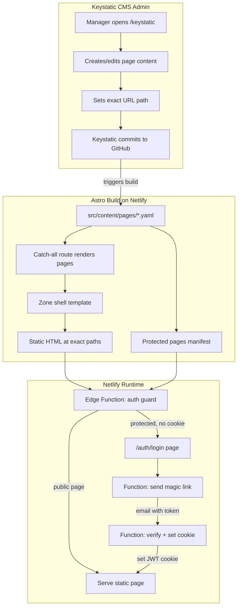

# Migrate poweredbylincx.com to Git-Based CMS

> **Status:** Pending Approval  
> **Date:** March 23, 2026  
> **Author:** Engineering  

---

## Summary

Migrate the static poweredbylincx.com site from manually-managed HTML files to a Git-based CMS powered by **Astro + Keystatic**, deployed on **Netlify**. This gives managers a visual editor to create and manage pages without touching code, while preserving all existing URLs and adding email-based access control for secret pages.

---

## Current State

- The repo contains **~56 static HTML pages** under `dist/`.
- Most pages are thin HTML shells that load Lincx zones via `<script src="https://api.lincx.com/load" data-zone-id="...">`.
- There is **no framework**, **no build system**, **no CMS**, and **no authentication**.
- Pages are organized by filesystem paths like `clients/preview/<client>/<slug>/index.html`.
- Deployed on Netlify.

---

## Proposed Stack

| Layer              | Technology                                     | Purpose                                        |
|--------------------|------------------------------------------------|------------------------------------------------|
| Framework          | [Astro](https://astro.build)                   | Static site generator with hybrid rendering    |
| CMS                | [Keystatic](https://keystatic.com)             | Git-based CMS with visual editor               |
| Email Protection   | Netlify Edge Functions + Magic Links           | Restrict secret pages to specific email addresses |
| Email Delivery     | [Resend](https://resend.com)                   | Send magic link emails (free tier: 3k/month)   |
| Hosting            | Netlify                                        | Current host, no migration needed              |

### Why Keystatic over DecapCMS?

- Better editing UX with a modern, polished admin interface
- TypeScript-first with stronger schema validation
- Better support for complex field types (repeating zone arrays, conditional fields)
- Actively maintained by Thinkmill
- DecapCMS is simpler to bolt on but has a less refined editor and slower development pace

### Why Astro?

- Purpose-built for static content sites
- Supports hybrid rendering (SSG for public pages, edge protection for secret pages)
- First-class Netlify adapter and native Keystatic integration
- Zero client-side JavaScript by default (fast page loads)

---

## Architecture Diagram



---

## What Managers Will See

### Creating a New Page

Managers access the CMS admin at `poweredbylincx.com/keystatic` and authenticate with their GitHub account. From there they can:

1. **Create a new page** by clicking "New Page" in the Pages collection
2. **Set the exact URL path** (e.g., `clients/preview/twc/new-campaign`) -- this becomes the live URL
3. **Add Lincx zones** by entering zone IDs and toggling test mode per zone
4. **Optionally protect the page** by checking "Email Protected" and adding allowed email addresses
5. **Save** -- Keystatic commits the changes to GitHub, Netlify auto-deploys in ~1 minute

### Editing an Existing Page

Click any page in the list, edit fields, save. Same commit-and-deploy flow.

### No Code Required

Managers never see HTML, CSS, or Git commands. The CMS provides a form-based UI for all page configuration.

---

## Content Schema

Each page managed by the CMS has the following fields:

| Field           | Type              | Required | Description                                                    |
|-----------------|-------------------|----------|----------------------------------------------------------------|
| Title           | Text              | Yes      | Page `<title>` tag                                             |
| URL Path        | Text              | Yes      | Exact URL path, e.g. `clients/preview/twc/vsg-listicle`       |
| Page Type       | Select            | Yes      | `zone-shell`, `multi-zone`, or `custom-html`                  |
| Zones           | Repeating group   | Yes      | Each zone has a `zoneId` (text) and `testMode` (checkbox)      |
| Custom CSS      | Multiline text    | No       | Inline CSS injected into the page                              |
| Extra Scripts   | Repeating group   | No       | Additional script URLs to load                                 |
| Email Protected | Checkbox          | No       | Whether the page requires email verification to access         |
| Allowed Emails  | List of emails    | No       | Which email addresses can access the page (when protected)     |
| Custom HTML     | Multiline text    | No       | Full custom HTML body (for non-zone pages like the homepage)   |

---

## Email Protection for Secret Pages

### How It Works

1. A visitor navigates to a protected page (e.g., `/internal/grouptest2`)
2. A Netlify Edge Function intercepts the request and checks if the page is protected
3. If protected and the visitor has no valid auth cookie, they are redirected to a login page
4. The login page asks for their email address
5. A serverless function checks the email against the page's allowed list
6. If allowed, a magic link is sent to their email
7. Clicking the magic link sets a secure cookie and redirects to the protected page
8. Subsequent visits use the cookie (valid for a configurable period, e.g., 7 days)

### Key Properties

- **No passwords** -- visitors just enter their email and click a link
- **Per-page control** -- each page has its own list of allowed emails, managed in the CMS
- **Secure** -- uses JWT tokens with expiration, HttpOnly cookies
- **No third-party auth service** -- built on Netlify's infrastructure + Resend for email delivery

### Required Environment Variables (Netlify)

- `RESEND_API_KEY` -- API key for sending magic link emails
- `JWT_SECRET` -- Secret key for signing/verifying JWT tokens

---

## Migration Plan

All 56 existing pages will be automatically migrated using a script:

1. Scan all `index.html` files under current `dist/`
2. Parse each file to extract: title, zone IDs, test mode flags, custom CSS, extra scripts
3. Generate corresponding content files in `src/content/pages/`
4. Preserve the exact directory path as the URL path

### Example Migration

**Before** (`dist/clients/preview/twc/vsg-listicle/index.html`):
```html
<!DOCTYPE html>
<html lang="en">
<head>
  <meta charset="UTF-8">
  <meta name="viewport" content="width=device-width, initial-scale=1.0">
  <title>Zone: 7shme6</title>
</head>
<body>
  <script src="https://api.lincx.com/load" data-zone-id="7shme6" data-test-mode></script>
</body>
</html>
```

**After** (CMS content entry):
```yaml
title: "Zone: 7shme6"
urlPath: "clients/preview/twc/vsg-listicle"
pageType: "zone-shell"
zones:
  - zoneId: "7shme6"
    testMode: true
isProtected: false
allowedEmails: []
```

**Result**: Same URL, same rendered HTML, now manageable through the CMS.

---

## Project Structure

```
poweredbylincx.com/
  astro.config.mjs           # Astro config with Netlify adapter
  keystatic.config.ts         # Keystatic CMS schema definition
  netlify.toml                # Build config + edge function mapping
  package.json                # Dependencies
  src/
    content/
      pages/                  # CMS-managed content files (YAML)
    layouts/
      ZoneShell.astro         # Template for zone-based pages
    pages/
      [...slug].astro         # Catch-all route for all CMS pages
      index.astro             # Homepage
      keystatic/
        [...path].astro       # Keystatic admin UI
      auth/
        login.astro           # Magic link login page
  netlify/
    edge-functions/
      auth-guard.ts           # Edge function for page protection
    functions/
      send-magic-link.ts      # Sends magic link emails
      verify.ts               # Verifies token and sets auth cookie
  scripts/
    migrate.ts                # One-time migration script
```

---

## Implementation Phases

### Phase 1: Foundation (Days 1-2)
- [ ] Scaffold Astro project with Netlify adapter and Keystatic
- [ ] Define content schema in Keystatic config
- [ ] Create page templates (zone-shell, multi-zone, custom-html)
- [ ] Set up catch-all routing

### Phase 2: Migration (Day 3)
- [ ] Write and run migration script for all 56 existing pages
- [ ] Verify all pages render identically at their original URLs
- [ ] Migrate homepage

### Phase 3: CMS Admin (Day 4)
- [ ] Set up Keystatic admin routes
- [ ] Test page creation and editing workflow
- [ ] Verify Git commit flow (edit in CMS -> commit -> rebuild -> live)

### Phase 4: Email Protection (Days 5-6)
- [ ] Implement edge function auth guard
- [ ] Build login page and magic link flow
- [ ] Set up Resend integration for email delivery
- [ ] Test end-to-end protection flow

### Phase 5: Testing and Deploy (Day 7)
- [ ] Full regression test of all 56 migrated pages
- [ ] Test CMS workflow with a manager
- [ ] Test email protection on secret pages
- [ ] Deploy to production

---

## Key Decisions

| Decision | Rationale |
|----------|-----------|
| All pages remain static (SSG) | Edge function handles auth before serving static files -- no SSR latency |
| Keystatic in GitHub mode | Managers authenticate with GitHub to edit. Each save creates a Git commit triggering a Netlify rebuild |
| Magic links over OAuth | Simpler UX for page visitors (no Google account required), works with any email |
| Build-time protected manifest | Avoids runtime DB lookups. Changing access requires a CMS edit + rebuild (~1 min) |
| Resend for email delivery | Simple API, generous free tier (3k emails/month), no infrastructure to manage |

---

## Risks and Mitigations

| Risk | Mitigation |
|------|------------|
| Build time increases with page count | Astro builds are fast; 56 pages should build in <30 seconds |
| Manager unfamiliar with GitHub auth | Keystatic's GitHub OAuth flow is one-click; provide onboarding doc |
| Magic link emails delayed or in spam | Use Resend with custom domain verification; add fallback instructions |
| Edge function adds latency | Netlify edge functions run at CDN edge (~1-5ms overhead); negligible |

---

## Approval

- [ ] **Engineering Lead** -- Technical approach approved
- [ ] **Product Manager** -- Feature scope and UX approved
- [ ] **Operations** -- Deployment and environment variables confirmed

**To proceed, please check the boxes above or reply with feedback.**
